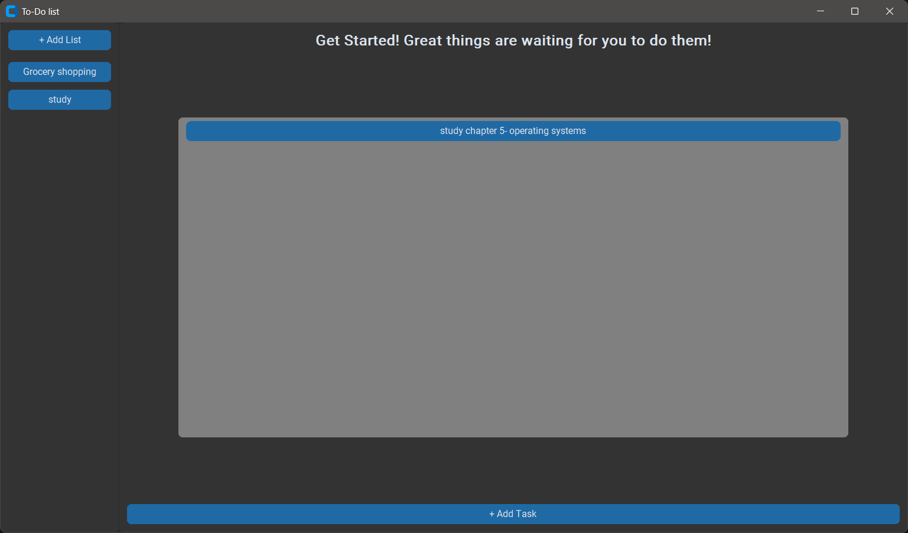

# To-Do List Application

A modern desktop To-Do List application built with Python, Tkinter, CustomTkinter, and SQLite.

This application allows users to create multiple task lists using a sidebar interface. Each list opens its own dedicated task frame where tasks can be added and managed dynamically.

---

# Features

- Create multiple task lists
- Sidebar navigation for lists
- Each list has its own task frame
- Add tasks dynamically
- Double-click a list name to delete the list
- Double-click a task name to delete the task
- Persistent data storage using SQLite
- Modern GUI using CustomTkinter

---

# Screenshots

## Main Window

<!-- INSERT MAIN WINDOW SCREENSHOT HERE -->



---


# Technologies Used

- Python
- Tkinter
- CustomTkinter
- SQLite

---

# Installation

## Clone the repository

```bash
git clone  https://github.com/Basantyaser/To_do_app.git